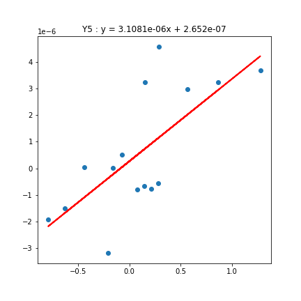
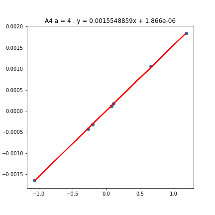
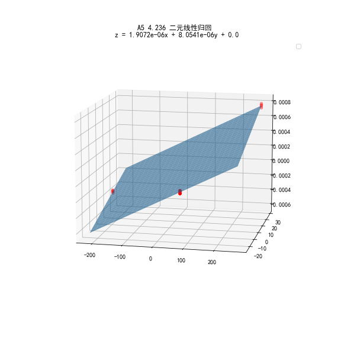

## 理论介绍
一个系统的复本征值和复本征向量可以用于描述系统处于特定博弈状态的各个策略的概率波动的幅度和相位。所以，每一个策略的时间函数都是复变量。那么，两个复变量(X,Y)的协方差($\sigma_{XY}$)可以是其耦合关系的一种测量。实耦合指的是两个复变量(X,Y)的协方差($\sigma_{XY}$)的实部。

本项目的目的是验证实耦合这个观测量的意义，填补领域中这一部分的空白。

## 项目介绍

本项目包含三大模块：

1.根据复制者动力学，计算特定博弈雅克比矩阵的特征向量，并计算特征向量分量两两之间的实耦合

2.从abed模拟仿真数据中，计算出策略两两之间的协方差

3.对数据进行分析。将实耦合与协方差数据进行线性回归，计算相关系数，绘制拟合图形

## 项目配置：

环境：
python：3.9.12

编辑器：
Visual Studio Code：1.77.3

插件：
Jupyter v2023.3.1201040234

## 文件介绍

from_eigenvector_out_XY.py：实现模块一，使用sympy库计算三种矩阵（A4，A5，Y5）的特征向量，并计算实耦合。其中A4矩阵需要一个参数，A5矩阵需要两个参数。具体见代码

calculate.py：实现从csv文件中计算策略之间的协方差

demo.ipynb：Y5,A4,A5三种矩阵各自有一个demo。第一部分调用上述文件的函数得到计算结果，进行拟合，计算相关系数。第二部分分析数据，对数据结果绘制拟合线段

data：数据文件，文件名格式：矩阵类型 + a值 + Strategy_distributions  数据来源：abed仿真

result：计算结果，文件名格式：矩阵类型 + a值 + result

figure：线性回归拟合的图形，其中A5矩阵对两种模式进行了二元线性回归

## 结果分析
对线性回归及拟合的结果进行分析（见figure以及result），可以发现，在A4,Y5矩阵中，策略协方差与实耦合之间有着明显的线性关系；
在A5矩阵中，策略协方差与两种模式的实耦合也具有明显的线性性质。

Y5  x轴：实耦合  y轴：策略协方差

A4 a = 4 ,  x轴：实耦合  y轴：策略协方差

A5 a = 4.236 ,  x轴：模式1实耦合  y轴：模式2实耦合 z轴:策略协方差

由此验证了实耦合的重大意义，为通过实耦合这个观测量，来预测策略之间的关系提供了理论基础。

